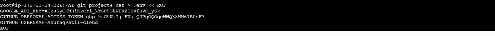
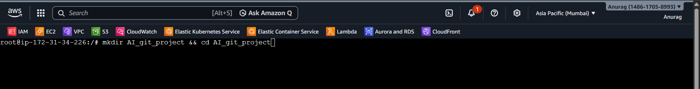
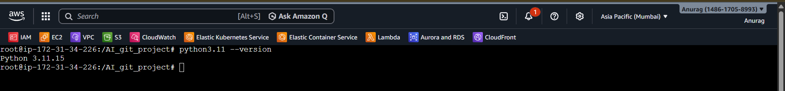
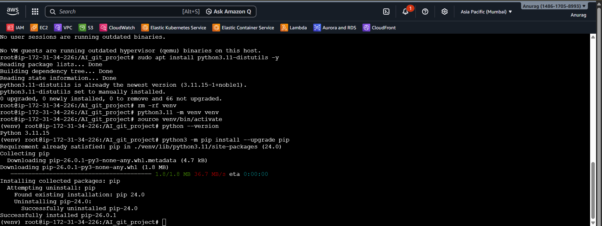
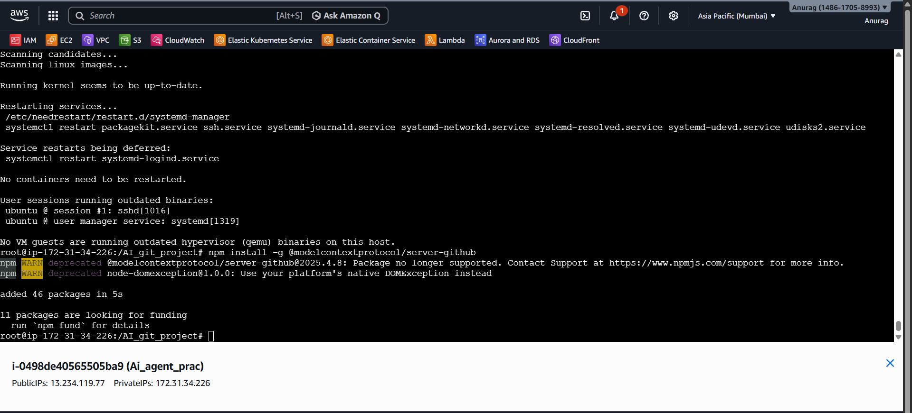
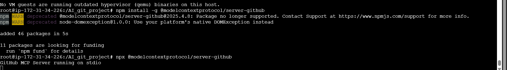
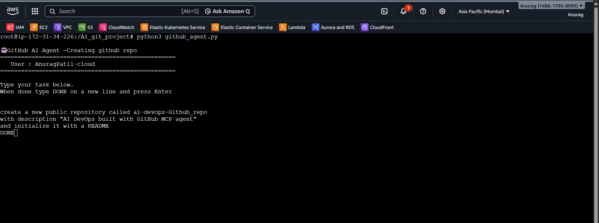
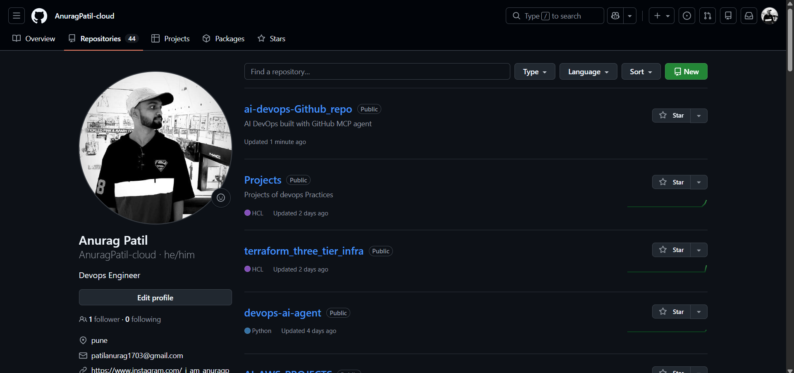
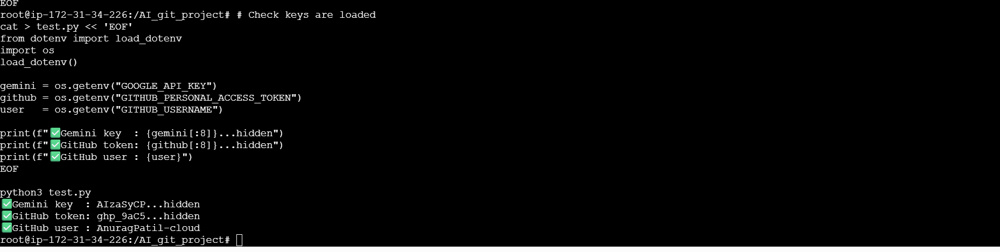
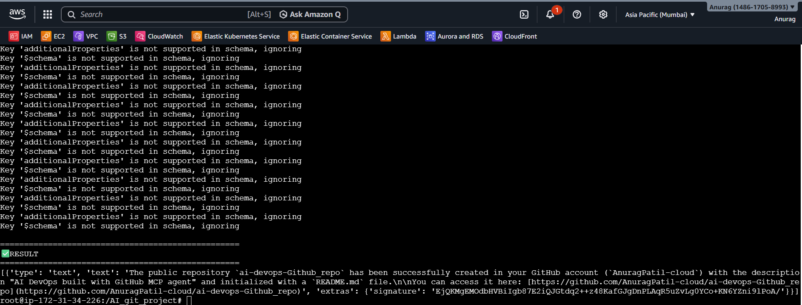

# 🚀 AI DevOps GitHub Agent (MCP + Gemini)

Control GitHub using **plain English** with an AI agent powered by MCP (Model Context Protocol) and Gemini.

---

## 📌 Project Overview

This project demonstrates how to:

* Use an AI agent to perform GitHub operations
* Automate repo, branches, PRs, issues
* Avoid writing GitHub API code

---

## 🧠 How It Works

```
You:     "create a branch called feature/test"
Agent:   Understands → Picks GitHub tool → Executes
Result:  Branch created instantly
```

---

## 🏗️ Project Structure

```
ai-devops-Github_repo/
├── Steps.md
├── HOW_IT_WORKS.md
├── screenshots/
├── test.py
├── list_tools.py
├── github_agent.py
├── .env
├── .gitignore
└── venv/
```

---

## ⚙️ Setup Steps (Summary)

### 1. Install Python 3.11

```bash
sudo apt update
sudo apt install python3.11 python3.11-venv python3.11-distutils -y
```

---

### 2. Create Virtual Environment

```bash
python3.11 -m venv venv
source venv/bin/activate
```

---

### 3. Install Dependencies

```bash
pip install langchain langchain-google-genai \
langchain-mcp-adapters python-dotenv rich
```

---

### 4. Install GitHub MCP Server

```bash
npm install -g @modelcontextprotocol/server-github
```

---

### 5. Setup Environment Variables

```bash
cat > .env << EOF
GOOGLE_API_KEY=your_key
GITHUB_PERSONAL_ACCESS_TOKEN=your_token
GITHUB_USERNAME=your_username
EOF
```

---

### 6. Run Agent

```bash
python3 github_agent.py
```

---

## 🧪 Testing

### Verify Keys

```bash
python3 test.py
```

---

### List MCP Tools

```bash
python3 list_tools.py
```

---

## 🎯 Features

✅ Create repositories
✅ Create branches
✅ Push files
✅ Create pull requests
✅ Merge PRs
✅ Manage issues
✅ Fully automated GitHub workflow

---

## 📸 Screenshots

### 🔑 API Keys Setup



---

### 📁 Create Project Directory



---

### 🧪 Python Installation



---

### ⚙️ Install venv & pip



---

### 📦 Install MCP Server



---

### 🚀 MCP Server Running



---

### 🤖 Give Task to Agent



---

### 📂 Repository Created



---

### 📄 Test Script Output



---

### ✅ Final Result



---

## 🔥 Example Tasks

```
create a new repository called ai-devops-series
DONE
```

```
create a branch called feature/devops
DONE
```

```
create a pull request
DONE
```

---

## ⚠️ Important Notes

* Never commit `.env`
* Always activate virtual environment
* Ensure tokens have correct permissions

---

## 🛠️ Troubleshooting

| Issue           | Fix                     |
| --------------- | ----------------------- |
| pip not found   | install python3-pip     |
| venv error      | install python3.11-venv |
| MCP not running | reinstall npm package   |

---

## 💡 Future Improvements

* Add UI dashboard
* Integrate with CI/CD
* Multi-repo automation
* Slack integration

---

## 👨‍💻 Author

**Anurag Patil**
DevOps | Cloud | AI Automation

---

## ⭐ Support

If you like this project:

* ⭐ Star the repo
* 🍴 Fork it
* 📢 Share it

---
